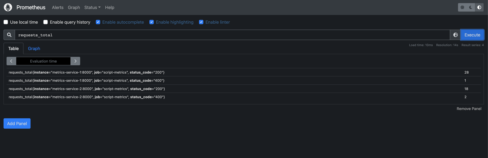
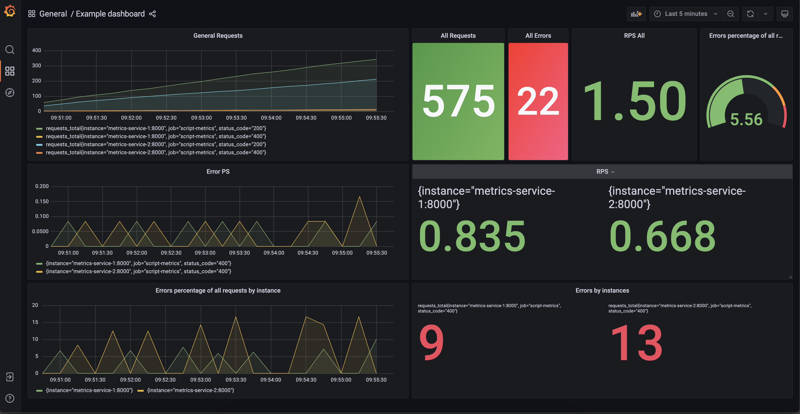

## Overview
This project is an example of tracking metrics of go services.

The project consists of 5 microservices and each runs in a container in docker-compose:
1. Metrics-service-1 - go service for collecting metrics from.
2. Metrics-service-2 - go service for collecting metrics from.
3. Generator - multithreading service request generator.
4. Prometheus - software application used for event monitoring and alerts.
5. Grafana - data visualization software system.

## Start
To start the project you must run the command in the terminal:
```bash
make dockerup
```

To stop, run the command:
```bash
make dockerstop
```

## Metrics
To get metrics from each service manually you need to send a GET request to:
1. Metrics-service-1 - http://localhost:8000/metrics
2. Metrics-service-2 - http://localhost:8010/metrics

Main metric -`requests_total`

## Prometheus
`Prometheus` available at the link: http://localhost:9090
<p align="left">
    
</p>

## Grafana
`Grafana` with pre-configured dashboards available at the link: http://localhost:3000/d/_eX4mpl3/example-dashboard?orgId=1&refresh=5s
<p align="left">
    
</p>